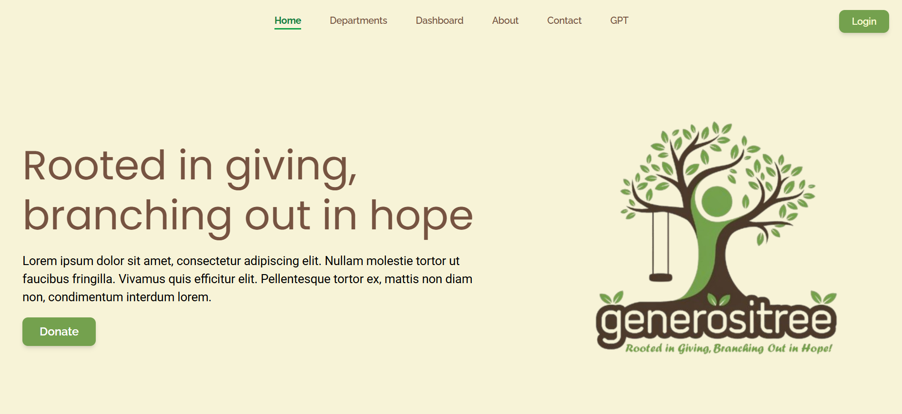
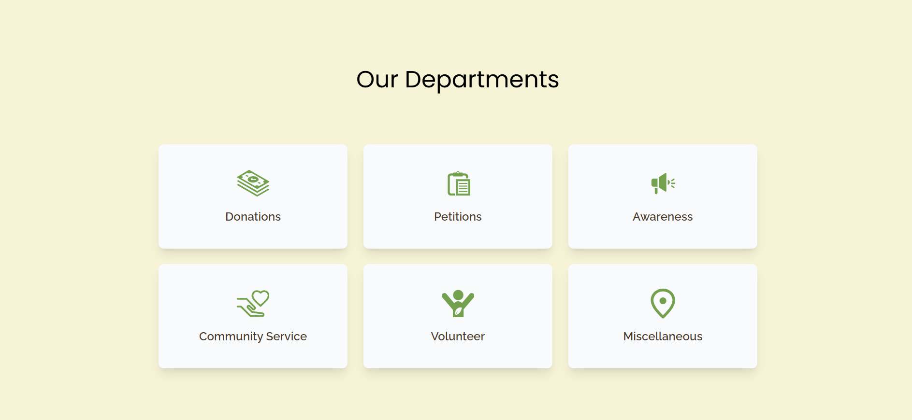
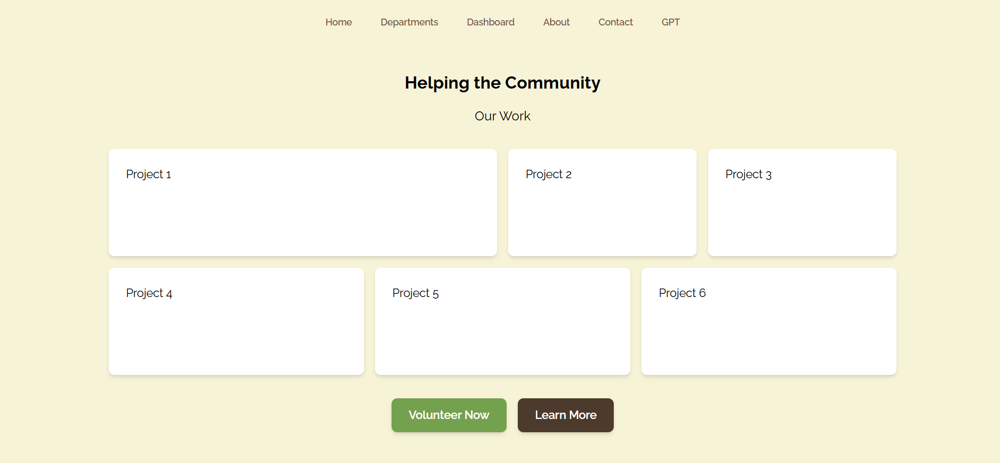
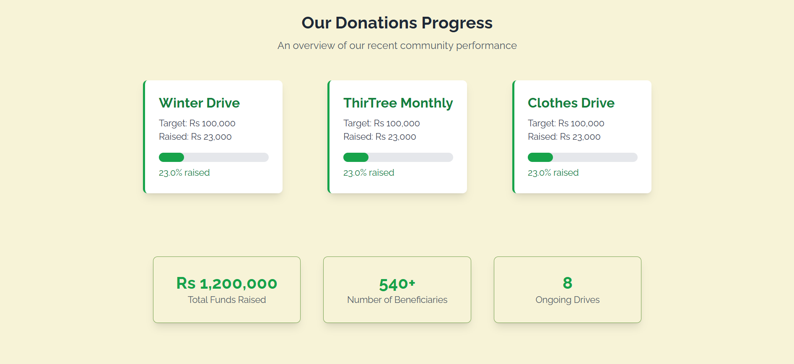
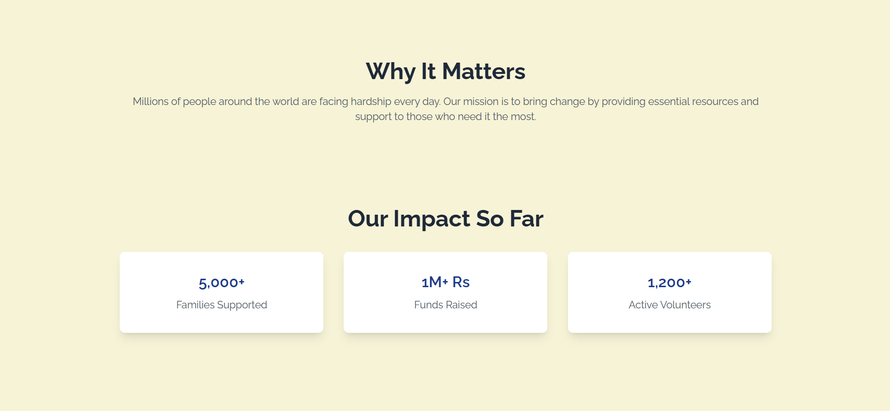
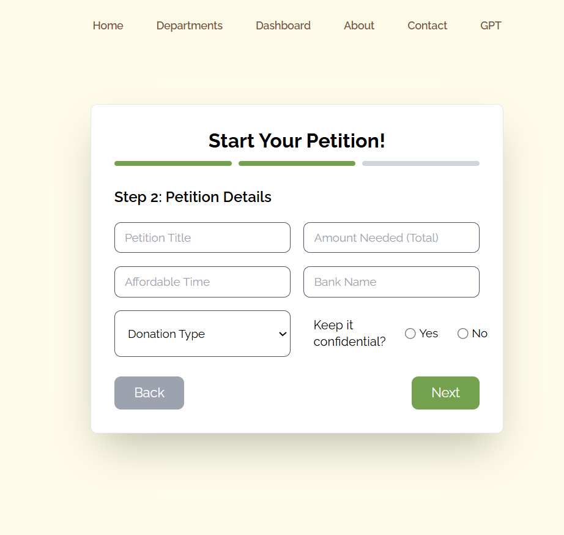

# GenerosiTree

A community service platform that helps conduct donations, petitions, awareness campaigns and volunteer work through a simple web-based system.

> Built with React.js, Tailwind CSS, and modern frontend tools.




## Live Demo

https://generosi-tree.vercel.app/


## Overview

GenerosiTree is a community service initiative created to support humanitarian causes by raising awareness, organizing donations, promoting petitions, and encouraging volunteer participation.

The platform provides different departments for social impact work, allowing users to explore causes, contribute to campaigns, and participate in meaningful community service activities.


## Features

- Donation campaign management
- Petition and awareness sections
- Community service initiatives
- Volunteer work opportunities
- Department-based navigation
- Clean and responsive user interface
- Map, graph, and data-based sections
- Humanitarian issue awareness


## Departments

- Donations
- Petitions
- Awareness
- Community Service
- Volunteer


## Tech Stack

### Frontend

- React.js
- Tailwind CSS
- JavaScript
- CSS


## Project Structure

```text
generositree/
├── public/
├── src/
│   ├── api/
│   ├── data/
│   ├── forms/
│   ├── graphs/
│   ├── maps/
│   ├── pages/
│   ├── svgs/
│   ├── ui/
│   ├── App.jsx
│   ├── index.css
│   └── main.jsx
```


## Screenshots

### Home Page


### Departments



### Community Service



### Donations



### Awareness



### Petition




## What I Learned

- Building structured React applications
- Creating reusable frontend components
- Designing clean community-focused interfaces
- Building a project around real-world social impact


## Future Improvements

- User authentication
- Admin dashboard improvements
- Donation payment integration
- Volunteer registration system
- Campaign analytics
- Email notifications
- Mobile app version


## About GenerosiTree

GenerosiTree is rooted in the idea of giving and growing hope through community service. It aims to bring people together for causes that matter and make social impact more accessible.


## If you found this project interesting, consider giving it a star ⭐
